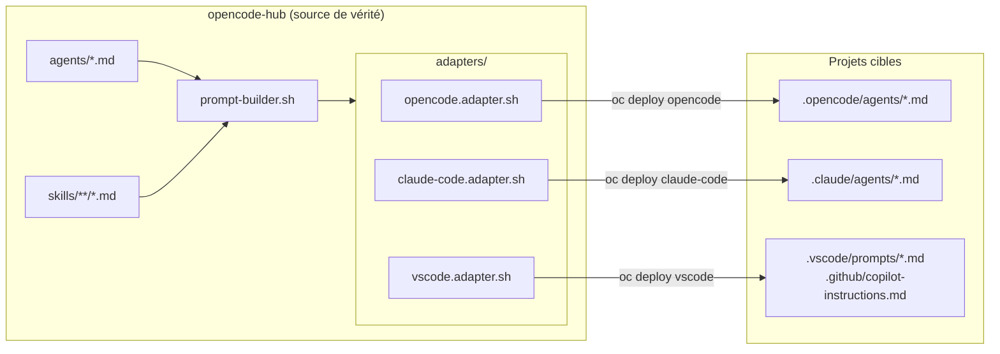
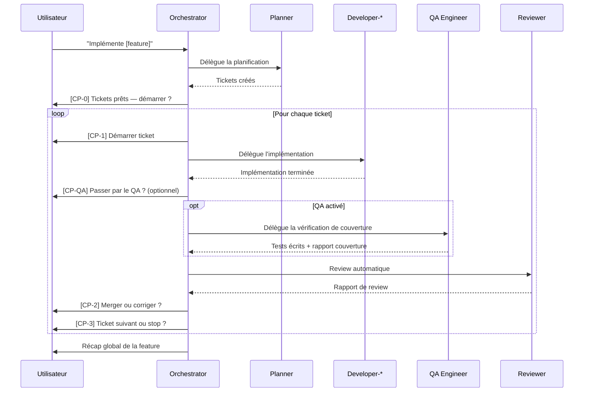
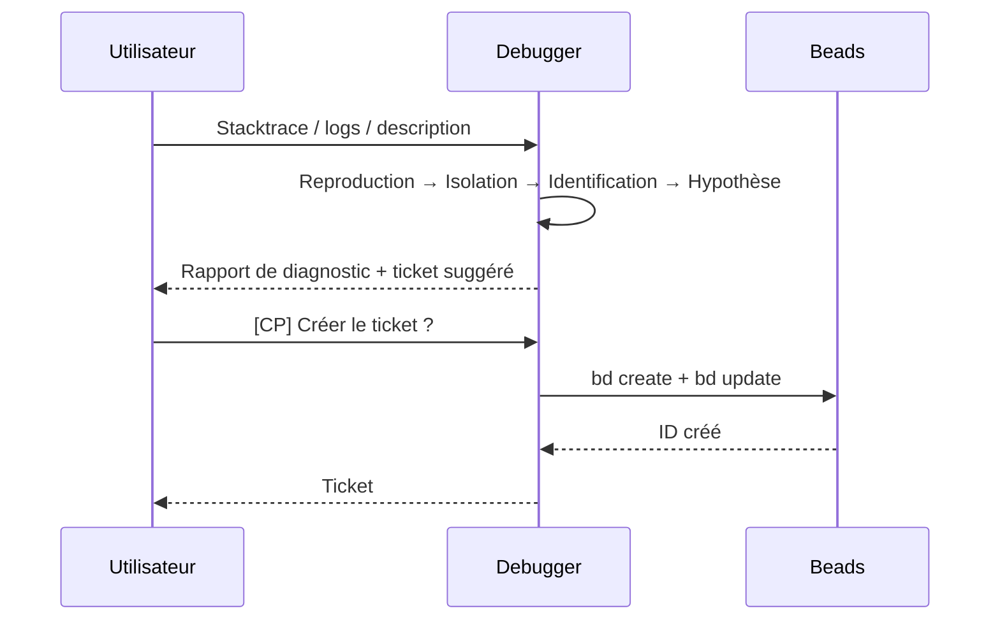

# Vue d'ensemble de l'architecture

## Concepts fondamentaux

### Hub

Le **hub** (`opencode-hub`) est le dépôt central qui contient les sources canoniques
de tous les agents et skills. C'est la source de vérité — on édite toujours ici,
jamais dans les projets cibles.

### Agent

Un **agent** est un fichier Markdown (`.md`) qui définit l'identité d'un rôle IA :
qui il est, ce qu'il fait, ce qu'il ne fait pas, et son workflow condensé.
Les agents sont courts (~40-80 lignes) et ne contiennent pas les protocoles détaillés.

Voir [agents.md](./agents.md) pour la référence complète.

### Skill

Un **skill** est un bloc de protocole injectable : format de rapport, checklist,
règles de comportement, exemples. Les skills sont déclarés dans le frontmatter
de l'agent (`skills: [...]`) et assemblés au déploiement.

Un skill peut être partagé entre plusieurs agents (ex: `dev-standards-universal`
est injecté dans tous les agents développeurs et dans le reviewer).

Voir [skills.md](./skills.md) pour la référence complète.
Voir [ADR-001](./adr/001-agent-skill-separation.md) pour la décision de séparation.

### Adapter

Un **adapter** est un script shell (`scripts/adapters/<cible>.adapter.sh`) qui
traduit les agents + skills du format hub vers le format attendu par un outil cible.
Trois adapters existent : `opencode`, `claude-code`, `vscode`.

### Projet cible

Un **projet cible** est un dépôt applicatif sur lequel les agents sont déployés
via `oc deploy`. Le hub connaît les projets via `projects/projects.md`.

---

## Diagramme — Flux de déploiement



---

## Diagramme — Workflow orchestrateur



---

## Diagramme — Workflow debug



---

## Principes de design

### 1. Séparation identité / protocole

L'agent définit **qui** il est, le skill définit **comment** il travaille.
Cette séparation permet la réutilisation des protocoles entre agents et maintient
les fichiers agents lisibles.

→ [ADR-001](./adr/001-agent-skill-separation.md)

### 2. Spécialisation plutôt que généralisme

Les agents développeurs sont segmentés en 7 spécialisations pour que chaque agent
reçoive uniquement le contexte pertinent à son domaine.

→ [ADR-002](./adr/002-developer-segmentation.md)

### 3. Checkpoints explicites

L'orchestrateur ne fait jamais avancer le workflow automatiquement. Chaque étape
critique nécessite une confirmation explicite de l'utilisateur.

→ [ADR-003](./adr/003-orchestrator-checkpoints.md)

### 4. Séparation des responsabilités de qualité

Implémenter, tester et diagnostiquer sont trois responsabilités distinctes confiées
à trois agents différents (developer, qa-engineer, debugger).

→ [ADR-004](./adr/004-qa-debugger-separation.md)

### 5. Lecture seule pour les agents non-développeurs

Les agents auditor, reviewer et debugger n'écrivent jamais dans le projet cible.
Seuls les agents developer et qa-engineer modifient des fichiers.

---

## Structure des fichiers

```
opencode-hub/
├── agents/          ← Sources canoniques des agents (éditer ici)
├── skills/          ← Protocoles et standards injectables
├── scripts/
│   ├── adapters/    ← Traduction hub → format outil cible
│   ├── lib/         ← Helpers partagés (prompt-builder, adapter-manager)
│   └── cmd-*.sh     ← Implémentation des commandes oc
├── config/
│   └── hub.json     ← Configuration globale du hub
├── projects/
│   ├── projects.md       ← Registre des projets (local, ignoré git)
│   └── projects.example.md ← Template versionné
└── docs/            ← Documentation (ce dossier)
    ├── architecture/
    ├── guides/
    └── reference/
```
