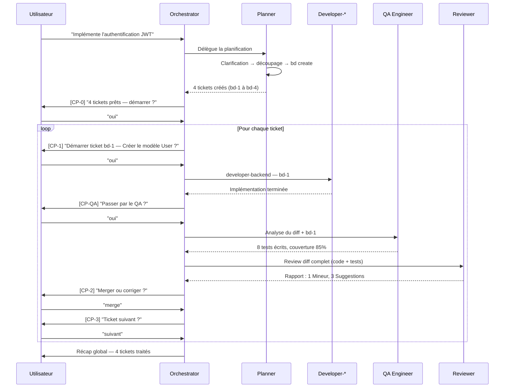
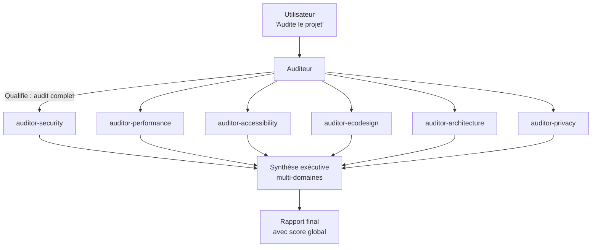
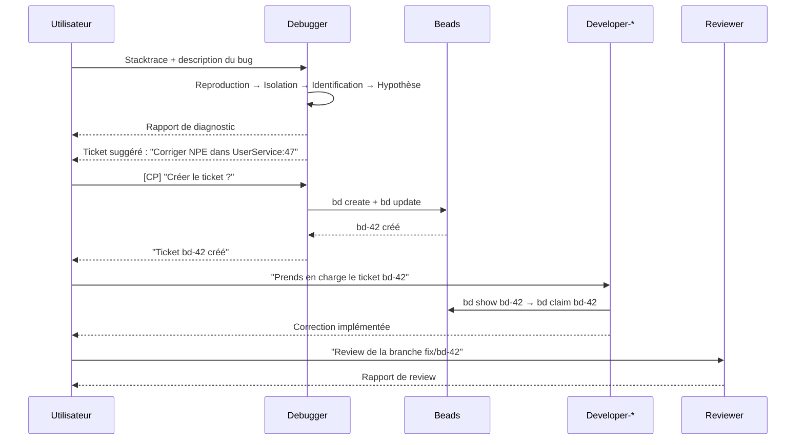

# Workflows

Ce guide illustre les trois scénarios principaux d'utilisation du hub,
de bout en bout, avec les prompts réels et les sorties attendues.

---

## Scénario 1 — Feature complète (orchestrateur)

**Contexte :** vous voulez implémenter une nouvelle feature de A à Z,
depuis la planification jusqu'au merge.

### Diagramme



### Étapes détaillées

#### 1. Lancer l'orchestrateur

```
Prompt : "Implémente la feature d'authentification JWT pour notre API REST"
```

L'orchestrateur annonce qu'il délègue au planner et l'invoque.

#### 2. Le planner décompose

Le planner pose ses questions de clarification, puis propose un découpage :

```
## 📋 Plan de décomposition — Authentification JWT

### Phase 1 — Modèle de données
- [ ] Créer le modèle User (P1, task)

### Phase 2 — Authentification
- [ ] Implémenter JWT (P1, feature)
- [ ] Endpoints login/logout (P1, feature)
- [ ] Refresh token (P2, feature)
```

Après validation, il crée les tickets avec `bd create` + `bd update`.

#### 3. [CP-0] Validation du plan

```
## Tickets planifiés — Authentification JWT

| ID    | Titre                  | Priorité | Type    |
|-------|------------------------|----------|---------|
| bd-1  | Créer le modèle User   | P1       | task    |
| bd-2  | Implémenter JWT        | P1       | feature |
| bd-3  | Endpoints login/logout | P1       | feature |
| bd-4  | Refresh token          | P2       | feature |

4 tickets prêts. Démarrer le workflow ? (oui/non)
```

#### 4. Workflow par ticket

Pour chaque ticket, l'orchestrateur :
1. Présente le ticket avec sa description complète `[CP-1]`
2. Identifie l'agent via la matrice de routing (ici `developer-backend`)
3. Délègue l'implémentation
4. Propose le QA `[CP-QA]`
5. Lance la review automatiquement
6. Présente le rapport `[CP-2]`
7. Clôture et demande de continuer `[CP-3]`

#### 5. Récap global

```
## Récap feature — Authentification JWT

| ID   | Titre                  | Agent             | QA  | Cycles | Statut     |
|------|------------------------|-------------------|-----|--------|------------|
| bd-1 | Créer le modèle User   | developer-backend | oui | 1      | ✅ Terminé |
| bd-2 | Implémenter JWT        | developer-backend | oui | 1      | ✅ Terminé |
| bd-3 | Endpoints login/logout | developer-backend | non | 2      | ✅ Terminé |
| bd-4 | Refresh token          | developer-backend | non | 1      | ✅ Terminé |

- Tickets traités : 4 / 4
- Total cycles de review : 5
- Corrections demandées : 1 fois (bd-3)
```

---

## Scénario 2 — Audit multi-domaines

**Contexte :** vous voulez un audit complet du projet avant une mise en production.

### Diagramme



### Étapes détaillées

#### 1. Audit complet

```
Prompt : "Audite le projet"
```

L'auditeur qualifie la demande comme un **audit complet** et délègue aux 6 sous-agents.

#### 2. Audit ciblé

```
Prompt : "Audite la sécurité et vérifie le RGPD"
```

L'auditeur délègue uniquement à `auditor-security` et `auditor-privacy`.

#### 3. Audit express (quick audit)

```
Prompt : "Quick audit"
```

L'auditeur délègue à `auditor-security`, `auditor-accessibility`, `auditor-performance`.

#### 4. Format du rapport de synthèse

```
## Synthèse Audit Multi-domaines — mon-projet

### Vue d'ensemble

| Domaine        | Score | Niveau | Critiques |
|----------------|-------|--------|-----------|
| Sécurité       | 6/10  | 🟠     | 2         |
| Performance    | 8/10  | ✅     | 0         |
| Accessibilité  | 5/10  | 🟠     | 1         |
| Éco-conception | 7/10  | 🟡     | 0         |
| Architecture   | 7/10  | 🟡     | 0         |
| Privacy (RGPD) | 9/10  | ✅     | 0         |

### Score global estimé
6.8/10 — Passable — 3 problèmes critiques à résoudre avant mise en production

### Top 5 des actions prioritaires
1. [Sécurité 🔴] Injection SQL possible — src/controllers/user.controller.ts:34
2. [Sécurité 🔴] Secret exposé dans le code — config/database.ts:12
3. [Accessibilité 🔴] Images sans attribut alt — src/components/Gallery.vue
4. [Sécurité 🟠] CORS mal configuré — src/middleware/cors.ts
5. [Accessibilité 🟠] Contraste insuffisant — src/styles/theme.css
```

---

## Scénario 3 — Cycle debug → fix

**Contexte :** un bug est signalé en production, vous avez une stacktrace.

### Diagramme



### Étapes détaillées

#### 1. Soumettre le bug au debugger

```
Prompt :
"Ce bug arrive en prod depuis ce matin :

TypeError: Cannot read properties of null (reading 'email')
    at UserService.findById (src/services/user.service.ts:47:20)
    at AuthController.login (src/controllers/auth.controller.ts:23:35)
    at Layer.handle [as handle_request] (express/lib/router/layer.js:95:5)

Contexte : se produit quand un utilisateur essaie de se connecter avec un
email inexistant. Fréquence : systématique."
```

#### 2. Rapport de diagnostic

```
## Diagnostic — TypeError null email dans UserService

### Symptôme
Login avec email inexistant lève une TypeError en production.
Comportement attendu : retourner une erreur 401 explicite.
Fréquence : systématique.

### Localisation probable
`src/services/user.service.ts:47`

### Hypothèse principale — haute probabilité
La méthode `findById` retourne `null` quand l'utilisateur n'existe pas,
mais la ligne 47 accède directement à `.email` sans vérification préalable.

Éléments qui l'étayent :
- La stacktrace pointe précisément sur `user.service.ts:47`
- Le message "Cannot read properties of null" confirme un accès sur null

Pour confirmer :
- Vérifier si `UserRepository.findByEmail` peut retourner null
- Chercher les guards null sur la valeur de retour avant la ligne 47

### Ticket de correction suggéré
Titre : Corriger l'absence de guard null dans UserService.findById
Type : bug | Priorité : P0
```

#### 3. Création du ticket

```
⏸️ Créer ce ticket dans Beads ? (oui/non)
→ oui

bd create "Corriger l'absence de guard null dans UserService.findById" -p 0 -t bug --json
→ Ticket bd-42 créé
```

#### 4. Correction et review

Le developer reçoit le ticket bd-42, lit le diagnostic dans les notes,
implémente la correction ciblée, et le reviewer vérifie la PR.

---

## Scénario 4 — Review seule

**Contexte :** vous avez développé une feature manuellement et voulez une review
avant de merger.

```
Prompt : "Review de ma PR — voici le diff :

<coller git diff ou nom de branche>"
```

Ou avec contexte Beads :

```
Prompt : "Review de la branche feat/user-profile — ticket bd-28"
```

Le reviewer lit le ticket bd-28 pour contextualiser, applique sa checklist
systématique, et produit un rapport structuré.
